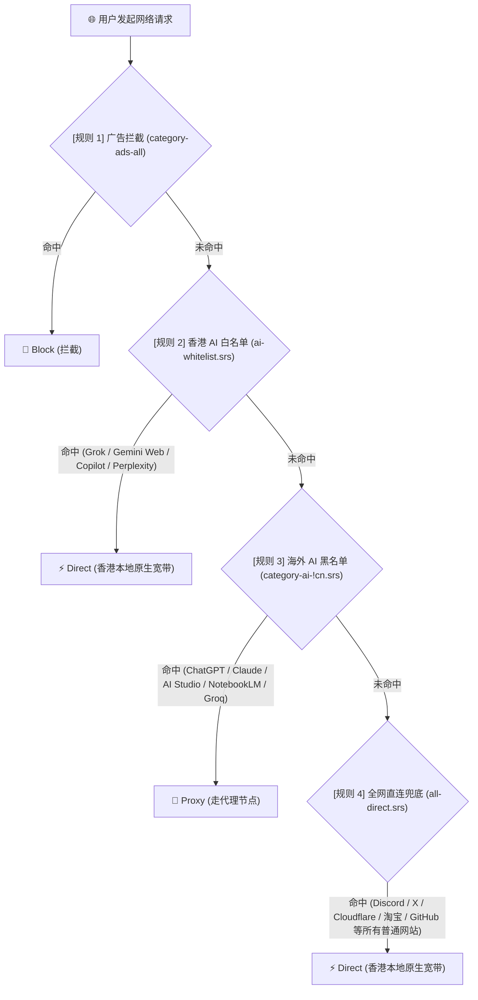

# 🇭🇰 Hong Kong AI Bypass & Direct Routing Rules for Sing-box / VilaNet

专为**中国香港（Hong Kong）**开发者与用户定制的 Sing-box 规则集（`.srs` / 二进制格式）。

实现 **“锁区 AI 智能分流走代理 + 本地开放 AI 直连 + 所有普通国内外网站 100% 直连”** 的极简分流体系，彻底告别“Discord、X、Cloudflare 等正常外网全被代理劫持”的痛点。

---

## 📌 痛点与背景

香港的网络环境具有独特性：
1. **日常互联网原生开放**：Google 搜索、YouTube、Discord、X (Twitter)、GitHub、Cloudflare、各大开源镜像源均可本地原生直连，拥有极佳的带宽和低延迟。
2. **部分欧美 AI 对港锁区**：OpenAI (ChatGPT/Sora)、Anthropic (Claude)、Google AI Studio、NotebookLM、Groq 等对香港 IP 实施服务封锁。
3. **部分 AI 对港完全或部分开放**：
   * xAI (Grok)：全功能开放；
   * Google Gemini：网页版 Chat (`gemini.google.com`) 开放，但开发者 API 与 NotebookLM 锁区；
   * GitHub Copilot、Perplexity、Cursor、Windsurf：完全可用。
4. **客户端架构冲突**：目前绝大多数代理客户端（VilaNet、Sing-box、Clash 衍生等）默认以“中国大陆突破 GFW”为核心，其规则引擎兜底策略（Fallback / Final）强制为 `Proxy`。一旦配置了海外 AI 走代理，容易导致所有未命中的海外网站全部被送入代理节点。

---

## 🏗️ 三层漏斗分流架构

本项目采用 **“上游黑名单基底 + 香港专属白名单穿透 + 全网直连兜底”** 架构：



### 核心优势：
* **零维护吃社区红利**：无需手动收集 ChatGPT、Claude 频繁变动的数十个 CDN/API 子域名，上游社区规则集自动覆盖。
* **精细化分流（同一服务拆分）**：Gemini 网页端走香港直连，同一账号下的 Google AI Studio 与 NotebookLM 自动走代理。
* **100% 杜绝代理泄漏**：尾部的 `all-direct.srs` 彻底堵住客户端的 Proxy 兜底，确保任何普通网站都不会白白消耗代理流量。
* **纯规则集链接驱动**：无需在客户端 UI 中一条条添加散乱的独立域名。

---

## 🔗 规则集订阅链接

| 规则集名称 | 动作 (Action) | 链接 (Raw GitHub) | 说明 |
| :--- | :---: | :--- | :--- |
| **`ai-whitelist.srs`** | **Direct** | `https://raw.githubusercontent.com/AndyZHENG0715/ai-bypass-srs-rules/main/ai-whitelist.srs` | **香港可用 AI 白名单**（优先放行直连） |
| **`category-ai-!cn.srs`** | **Proxy** | `https://raw.githubusercontent.com/vilavpn/meta-rules-dat/sing/geo/geosite/category-ai-!cn.srs` | **海外 AI 通用黑名单**（捕获锁区 AI） |
| **`ai-supplement.srs`** | **Proxy** | `https://raw.githubusercontent.com/AndyZHENG0715/ai-bypass-srs-rules/main/ai-supplement.srs` | **补充名单**（Suno / Udio / Meta AI 等） |
| **`all-direct.srs`** | **Direct** | `https://raw.githubusercontent.com/AndyZHENG0715/ai-bypass-srs-rules/main/all-direct.srs` | **全网直连兜底**（捕获所有其他互联网流量） |

*(如需要广告拦截，可在最上方加入社区的 `category-ads-all.srs` 并设为 Block)*

---

## 🛠️ 客户端配置指南

### 1. VilaNet 客户端配置

在 VilaNet 的 **设置 ➔ 规则设置 (Rules Settings)** 中，启用 **自定义规则**，并按以下严格顺序排列：

| 序号 | 规则集 URL | 动作 (Action) |
| :---: | :--- | :---: |
| 1 | `https://raw.githubusercontent.com/vilavpn/meta-rules-dat/sing/geo/geosite/category-ads-all.srs` | **Block (拦截)** |
| 2 | `https://raw.githubusercontent.com/AndyZHENG0715/ai-bypass-srs-rules/main/ai-whitelist.srs` | **Direct (直连)** |
| 3 | `https://raw.githubusercontent.com/vilavpn/meta-rules-dat/sing/geo/geosite/category-ai-!cn.srs` | **Proxy (代理)** |
| 4 | `https://raw.githubusercontent.com/AndyZHENG0715/ai-bypass-srs-rules/main/ai-supplement.srs` | **Proxy (代理)** |
| 5 | `https://raw.githubusercontent.com/AndyZHENG0715/ai-bypass-srs-rules/main/all-direct.srs` | **Direct (直连)** |

> [!TIP]
> **注意顺序**：`ai-whitelist.srs` 必须排在 `category-ai-!cn.srs` **之前**；`all-direct.srs` 必须排在**最末尾**。

---

### 2. 标准 Sing-box 官方配置示例 (`config.json`)

```json
{
  "route": {
    "rule_set": [
      {
        "tag": "ads",
        "type": "remote",
        "format": "binary",
        "url": "https://raw.githubusercontent.com/vilavpn/meta-rules-dat/sing/geo/geosite/category-ads-all.srs",
        "download_detour": "direct"
      },
      {
        "tag": "ai-whitelist",
        "type": "remote",
        "format": "binary",
        "url": "https://raw.githubusercontent.com/AndyZHENG0715/ai-bypass-srs-rules/main/ai-whitelist.srs",
        "download_detour": "direct"
      },
      {
        "tag": "ai-blocked",
        "type": "remote",
        "format": "binary",
        "url": "https://raw.githubusercontent.com/vilavpn/meta-rules-dat/sing/geo/geosite/category-ai-!cn.srs",
        "download_detour": "direct"
      },
      {
        "tag": "ai-supplement",
        "type": "remote",
        "format": "binary",
        "url": "https://raw.githubusercontent.com/AndyZHENG0715/ai-bypass-srs-rules/main/ai-supplement.srs",
        "download_detour": "direct"
      },
      {
        "tag": "all-direct",
        "type": "remote",
        "format": "binary",
        "url": "https://raw.githubusercontent.com/AndyZHENG0715/ai-bypass-srs-rules/main/all-direct.srs",
        "download_detour": "direct"
      }
    ],
    "rules": [
      { "rule_set": "ads", "outbound": "block" },
      { "rule_set": "ai-whitelist", "outbound": "direct" },
      { "rule_set": "ai-blocked", "outbound": "proxy" },
      { "rule_set": "ai-supplement", "outbound": "proxy" },
      { "rule_set": "all-direct", "outbound": "direct" }
    ],
    "final": "proxy"
  }
}
```

---

## 📋 当前已收录的白名单服务列表

香港本地直连放行的主要服务包括：
* **xAI**: Grok (`grok.com`, `grok.x.com`, `x.ai`, `grokipedia.com`)
* **Google**: Gemini 网页版 (`gemini.google.com`, `gemini.google`, `bard.google.com`)
* **Microsoft**: GitHub Copilot (`copilot.microsoft.com`, `githubcopilot.com` 等)
* **Perplexity AI**: (`perplexity.ai`, `pplx.ai`, `perplexity.com`)
* **开发辅助**: Cursor (`cursor.com`), Windsurf (`windsurf.com`), Codeium (`codeium.com`), Devin (`devin.ai`)
* **模型社区**: Hugging Face (`huggingface.co`, `hf.co`, `hf.space`), LMSYS Arena (`arena.ai`)
* **其他可用 AI**: Mistral AI (`mistral.ai`), Cohere (`cohere.com`), Cerebras (`cerebras.ai`), Midjourney (`midjourney.com`), Poe (`poe.com`), Kimi (`kimi.ai`)

---

## 🤝 维护与贡献 (Contribution)

本项目通过 **GitHub Actions** 每天定时自动从上游同步并编译构建 `.srs` 规则。

若未来某款 AI 服务宣布对香港开放，或发现有新开放的 AI 域名被误代理：
1. Fork 本仓库；
2. 编辑 [`scripts/hk-whitelist.txt`](scripts/hk-whitelist.txt)，在对应分类下添加关键字或域名；
3. 提交 Pull Request，合并后 GitHub Actions 将在几分钟内自动编译发布新的 `.srs` 规则文件。

---

## 📄 License
MIT License.
